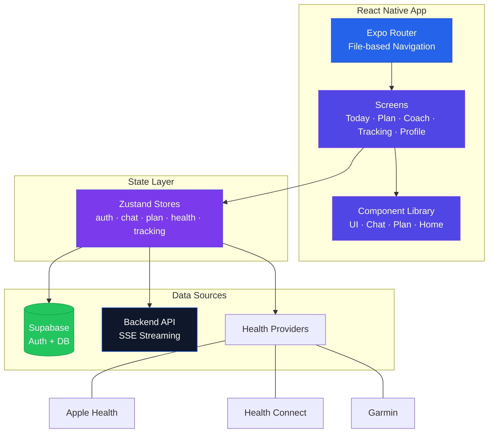
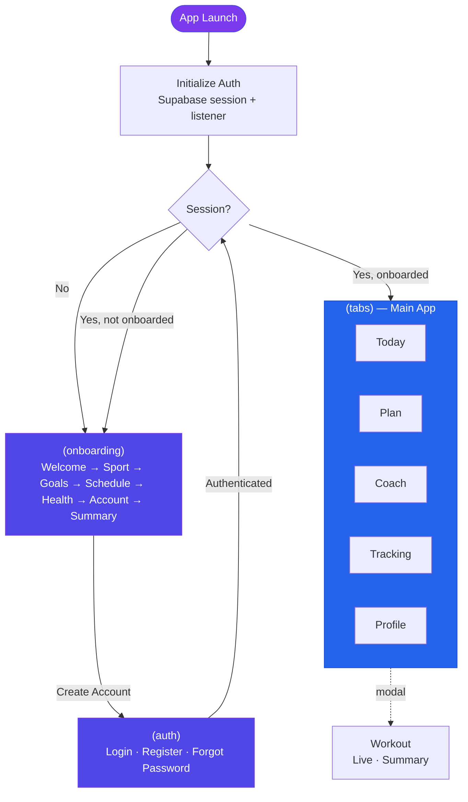
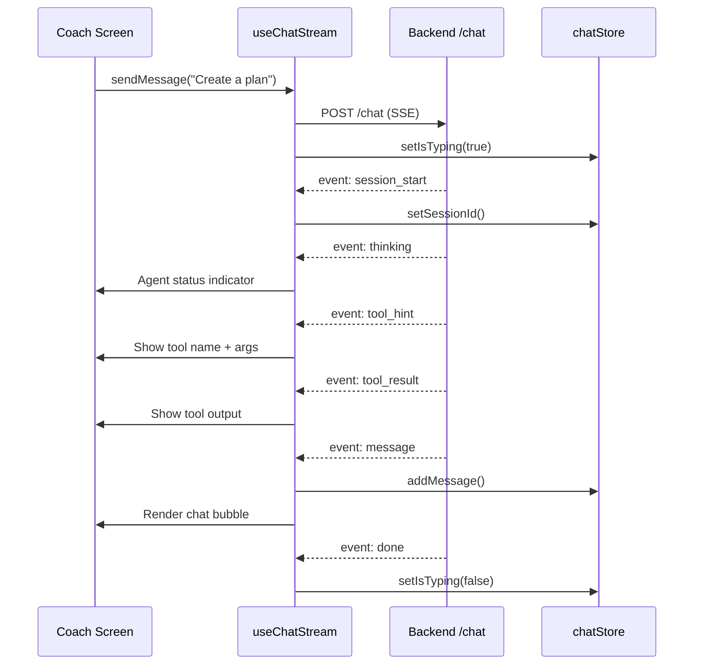
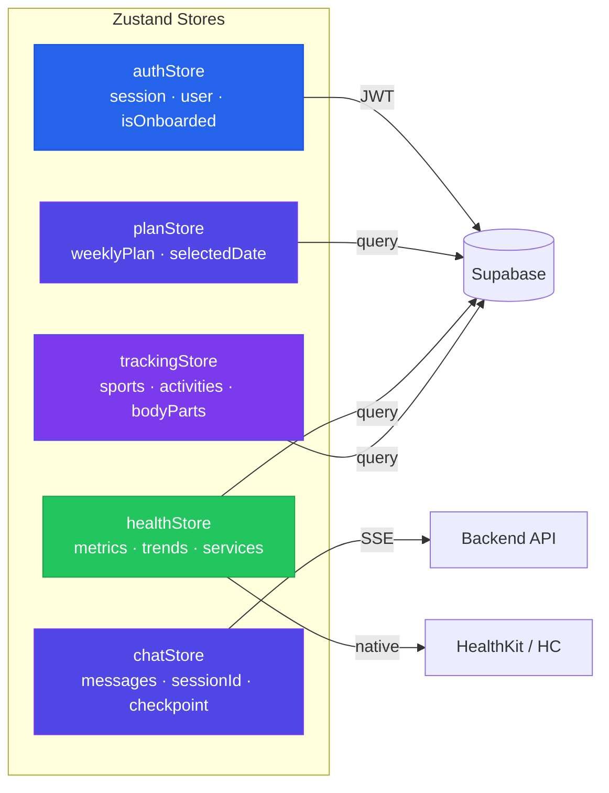
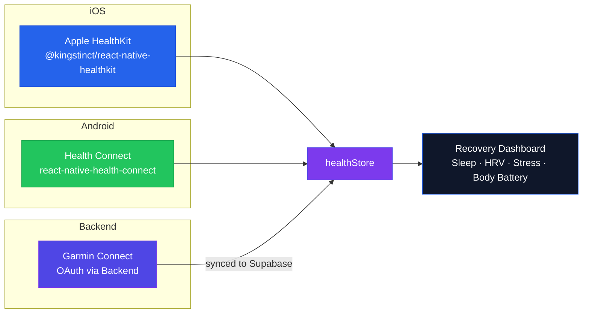
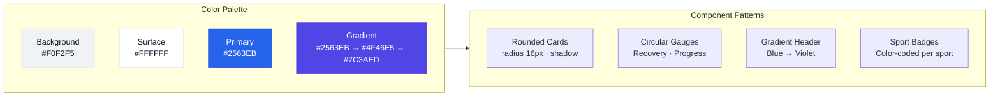

<div align="center">
  <h1>Athletly</h1>
  <h3>AI-Powered Sports Coaching — React Native App</h3>
  <p>
    
    
    
    
    
    
    
  </p>
</div>

---

A cross-platform fitness coaching app powered by an **autonomous AI agent**. The app connects to the [Athletly Backend](https://github.com/RnltLabs/athletly-backend) via **Server-Sent Events**, streaming every step of the agent's reasoning in real time. Built with **Expo Router** for file-based navigation, **NativeWind** (Tailwind CSS for React Native) for styling, and **Zustand** for immutable state management. Integrates with **Apple Health**, **Google Health Connect**, and **Garmin Connect** for wearable data.

---

## Table of Contents

- [App Architecture](#app-architecture)
- [Navigation & Routing](#navigation--routing)
- [SSE Chat Streaming](#sse-chat-streaming)
- [State Management — Zustand](#state-management--zustand)
- [Health Data Integration](#health-data-integration)
- [Companion Onboarding](#companion-onboarding)
- [Design System](#design-system)
- [Key Features](#key-features)
- [Tech Stack](#tech-stack)
- [Project Structure](#project-structure)
- [License](#license)

---

## App Architecture

The app follows a clean separation between navigation, state, and data. All AI interactions happen through the backend — the client streams events and renders the agent's reasoning in real time.



---

## Navigation & Routing

Expo Router provides file-based navigation with route groups for authentication, onboarding, and the main tab interface. The root layout acts as an auth guard — redirecting users based on session and onboarding status.



**Route structure:**
- `(auth)/` — Login, register, password reset (shown when not authenticated)
- `(onboarding)/` — 7-step companion flow (shown when authenticated but not onboarded)
- `(tabs)/` — Main app with 5 tabs: Today, Plan, Coach, Tracking, Profile
- `workout/` — Modal overlay for live workout tracking and post-workout summary

---

## SSE Chat Streaming

The coach screen connects to the backend via **Server-Sent Events**, streaming every stage of the AI agent's reasoning. The `useChatStream` hook manages the EventSource connection, parses events, and updates the chat store.



**Event types rendered in the UI:**
- `thinking` → Agent status indicator (pulsing dots)
- `tool_hint` → Tool name badge (e.g., "get_activities")
- `tool_result` → Collapsible tool output preview
- `message` → Chat bubble with Markdown rendering
- `pending_action` → Inline checkpoint card (accept / reject)

The hook also exposes `abort()` to cancel in-flight requests and tracks `usage` for token transparency.

---

## State Management — Zustand

All app state lives in **Zustand stores** with immutable update patterns. Each domain has its own store — no global monolith.



| Store | Responsibilities |
|---|---|
| **authStore** | Supabase session lifecycle, auth state listener, onboarding status check |
| **chatStore** | Message history, session management, checkpoint confirmation flow |
| **planStore** | Weekly plan fetching, day selection, session parsing from JSONB |
| **healthStore** | Daily metrics (sleep, HRV, stress), connected services, trends |
| **trackingStore** | Sport options, body parts, recent activities, quick-log state |

All stores use `set()` with new objects — no in-place mutations.

---

## Health Data Integration

The app reads wearable data from three providers through platform-native APIs and the backend.



- **Apple Health** (iOS): Direct HealthKit access for sleep, heart rate, HRV, steps, workouts
- **Health Connect** (Android): Google's unified health API for the same metrics
- **Garmin Connect**: OAuth flow handled by the backend, data synced to Supabase `health_daily_metrics`

The hooks `useAppleHealth` and `useHealthConnect` abstract platform differences behind a shared interface. The Today dashboard renders all metrics uniformly regardless of source.

---

## Companion Onboarding

A voice-enabled, 7-step onboarding flow that captures the athlete's profile before the AI agent bootstraps the coaching system.


- **Voice input** via `expo-speech-recognition` — athlete speaks their sports and goals
- **Transcript parsing** via backend `/api/onboarding/parse-voice` (Gemini 2.0 Flash extracts structured data from German speech)
- **Selectable tiles** for sports and goals with parsed tags highlighted
- **Day picker** for available training days
- **Health service connection** prompts (Apple Health, Health Connect)
- **Account creation** mid-flow (Supabase Auth)
- **Summary** triggers the backend onboarding agent which autonomously creates metrics, criteria, and the first training plan

---

## Design System

A light, modern theme inspired by premium fitness apps. Full specification in [`docs/design-system.md`](docs/design-system.md).



| Element | Specification |
|---|---|
| **Background** | Soft gray canvas `#F0F2F5` |
| **Cards** | Pure white `#FFFFFF`, radius 16px, shadow-based separation (no borders) |
| **Primary accent** | Royal blue `#2563EB` — all interactive elements |
| **Gradient header** | `#2563EB` → `#4F46E5` → `#7C3AED` (diagonal, top 25–30% of screen) |
| **Typography** | Inter font family, bold headings, regular body |
| **Icons** | Lucide React Native, 1.5px stroke width |
| **Sport colors** | Running `#3B82F6`, Cycling `#A855F7`, Swimming `#06B6D4`, Gym `#F59E0B` |

Styling is implemented via **NativeWind** (Tailwind CSS for React Native) — all components use `className` props with Tailwind utilities. Color tokens are defined in `tailwind.config.js` and `lib/colors.ts`.

---

## Key Features

### Today Dashboard
- Time-based greeting with gradient header
- Recovery gauge (circular visualization)
- Mini-cards for sleep, HRV, and stress
- Hero workout card (today's session or rest day)
- Week progress strip with day indicators
- Pull-to-refresh

### AI Coach Chat
- Real-time SSE streaming with agent status indicators
- Tool call visibility (thinking → tool → result → response)
- Inline checkpoint cards for plan approval
- Quick-reply suggestions
- Voice input via `expo-speech-recognition`

### Weekly Training Plan
- Week navigation with day selector strip
- Per-session cards with sport, duration, intensity, description
- Rest day cards with coach reasoning
- Weekly summary statistics
- Equipment recommendations linked to plan

### Activity Tracking
- Quick-log interface (sport, duration, intensity)
- Body-part targeting for strength training
- Recent activity history

### Profile & Settings
- Connected health services (Apple Health, Health Connect, Garmin)
- Garmin OAuth connection modal
- Account management (email, password, delete)

---

## Tech Stack

| Layer | Technology | Role |
|---|---|---|
| **Framework** | React Native 0.83 + Expo 55 | Cross-platform runtime with New Architecture |
| **Routing** | Expo Router | File-based navigation with route groups |
| **Language** | TypeScript 5.9 (strict) | Type safety across the entire codebase |
| **Styling** | NativeWind 4.2 + Tailwind CSS 3.4 | Utility-first styling via `className` |
| **State** | Zustand 5.0 | Immutable stores per domain |
| **Auth** | Supabase Auth + Expo Secure Store | JWT session management |
| **Streaming** | react-native-sse | Server-Sent Events for real-time chat |
| **Voice** | expo-speech-recognition | Speech-to-text for onboarding + chat |
| **Health (iOS)** | @kingstinct/react-native-healthkit | Apple HealthKit access |
| **Health (Android)** | react-native-health-connect | Google Health Connect access |
| **Animations** | react-native-reanimated 4.2 | Gesture-based animations |
| **Icons** | lucide-react-native | 400+ consistent icons |
| **Notifications** | expo-notifications | Push notification handling |
| **Haptics** | expo-haptics | Vibration feedback |

---

## Project Structure

```
athletly-app/
├── app/                           # File-based routing (Expo Router)
│   ├── _layout.tsx               #   Root layout with auth guard
│   ├── (auth)/                   #   Login · Register · Forgot Password
│   ├── (onboarding)/             #   7-step companion onboarding
│   │   └── welcome → sport → goals → schedule → health → account → summary
│   ├── (tabs)/                   #   Main tabbed interface
│   │   ├── index.tsx             #     Today dashboard
│   │   ├── plan.tsx              #     Weekly training plan
│   │   ├── coach.tsx             #     AI coach chat (SSE)
│   │   ├── tracking.tsx          #     Activity quick-log
│   │   └── profile.tsx           #     Profile & settings
│   └── workout/                  #   Modal: live workout + summary
│
├── components/
│   ├── ui/                       #   Design system (Button, Card, Input, CircularGauge, ...)
│   ├── home/                     #   Dashboard widgets (RecoveryGauge, MetricMiniCard, ...)
│   ├── chat/                     #   Chat bubbles, AgentStatus, CheckpointCard, QuickReplies
│   ├── plan/                     #   SessionCard, RestDayCard, WeekStrip, ProductBar
│   ├── profile/                  #   ProfileHeader, SettingsRow, GarminConnectModal
│   └── onboarding/               #   SelectableTile, DayPicker, CompanionCard, ParsedTags
│
├── store/                        #   Zustand stores
│   ├── authStore.ts              #     Session, user, onboarding status
│   ├── chatStore.ts              #     Messages, sessionId, checkpoints
│   ├── planStore.ts              #     Weekly plan, selected date
│   ├── healthStore.ts            #     Metrics, trends, connected services
│   └── trackingStore.ts          #     Sports, activities, body parts
│
├── hooks/                        #   Custom React hooks
│   ├── useChatStream.ts          #     SSE streaming from /chat endpoint
│   ├── useVoiceInput.ts          #     expo-speech-recognition wrapper
│   ├── useAppleHealth.ts         #     iOS HealthKit access
│   ├── useHealthConnect.ts       #     Android Health Connect access
│   └── usePushNotifications.ts   #     Notification setup + token management
│
├── lib/                          #   Utilities & services
│   ├── supabase.ts               #     Supabase client (secure storage adapter)
│   ├── api.ts                    #     HTTP client (apiGet, apiPost)
│   ├── colors.ts                 #     Color palette constants
│   ├── sport-colors.ts           #     Per-sport color mapping
│   └── parseVoice.ts             #     Voice transcript parsing
│
├── types/                        #   TypeScript definitions
│   ├── chat.ts                   #     ChatMessage, Checkpoint, StreamMessage
│   ├── plan.ts                   #     WeeklyPlan, DayPlan, PlannedSession
│   ├── health.ts                 #     HealthMetrics, HealthTrend
│   └── tracking.ts               #     SportOption, TrackedActivity
│
└── docs/
    ├── design-system.md          #   Full design specification
    └── companion-onboarding.md   #   Onboarding flow spec
```

---

## Backend

This app connects to the [Athletly Backend](https://github.com/RnltLabs/athletly-backend) — an autonomous AI coaching engine with an agentic loop, 23 specialized tools, belief-driven memory, and LiteLLM as the provider-agnostic LLM gateway.

---

## License

MIT
